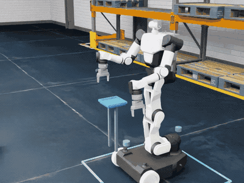
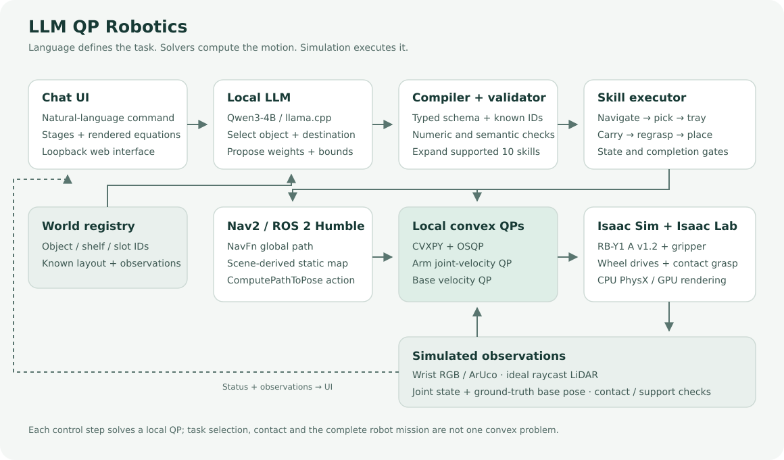
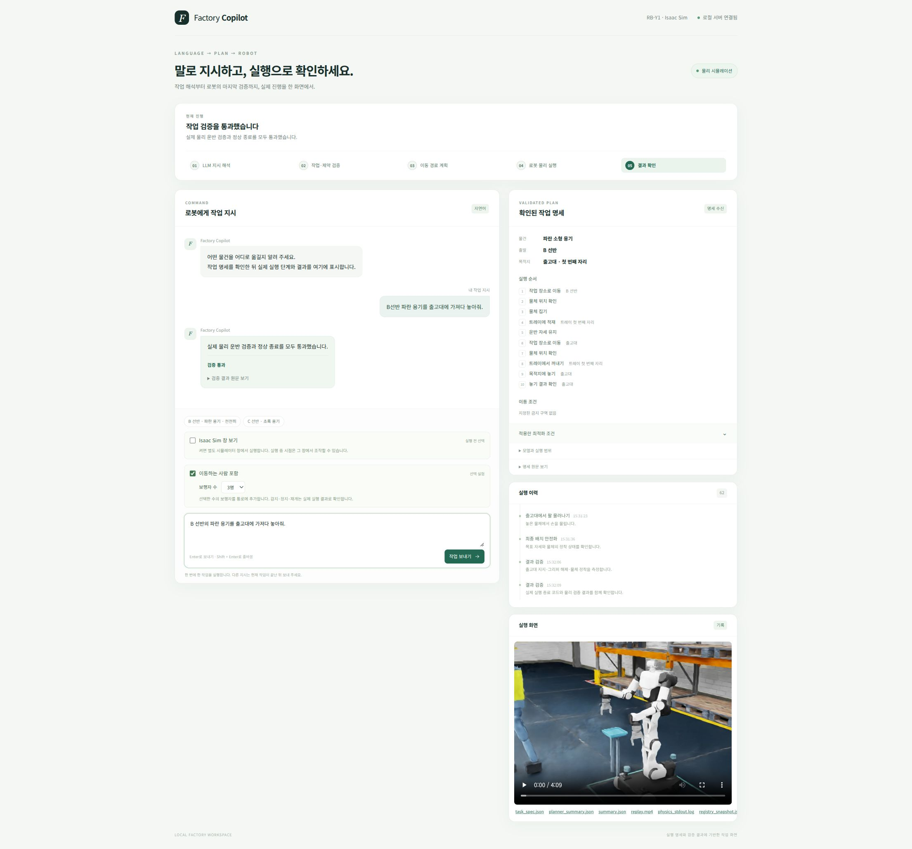

# LLM QP Robotics

**자연어 작업 지시를 로봇의 이동·집기·운반·하역으로 연결하는 Isaac Sim 기반 모바일 조작 시스템입니다.** Rainbow Robotics의 RB-Y1 모델, 로컬 Qwen LLM, ROS2 Nav2 전역 경로와 팔·베이스 QP를 연결합니다. 브라우저에서 지시를 보내고 작업 명세, 실행 단계, 활성 QP 수식과 영상을 확인할 수 있습니다.



미리보기는 성공한 B 선반 운반 영상의 10배속 편집입니다. [전체 데모 영상 다운로드 (MP4)](https://github.com/Idea4Future/llm-qp-robotics/raw/refs/heads/main/assets/docs/demo.mp4)은 시뮬레이션 시간 기준 영상으로 실제 계산 속도를 나타내지 않습니다.

[설치와 실행 안내](docs/ISAAC_SETUP.md)

## 작동 구조



1. **자연어 → 수치 명세:** Qwen3-4B가 등록된 물체·출발지·목적지 ID, 목적 가중치 6개와 제약값 6개를 제안합니다. 추가 학습 없이 고정 GGUF 모델을 사용합니다.
2. **명세 검토 → 스킬 확장:** typed schema, registry와 사용자 요구를 검사합니다. 프로그램이 허용된 오른팔 작업 template으로 확장하며, 모델의 숫자는 명세에 그대로 복사합니다. 실행기 상한은 별도로 교집합을 취합니다.
3. **경로 계획:** 실제 ROS2 Humble Nav2 `ComputePathToPose`와 NavFn(A* 설정)이 정적 지도의 전역 경로를 생성합니다.
4. **국소 QP → 제어:** 베이스 QP가 경로 추종 기준·바퀴 한계·관측 장애물 여유를 반영하고, 팔 QP가 현재 Jacobian으로 손끝 속도와 관절 명령을 계산합니다. CVXPY/OSQP 결과를 바퀴 구동과 관절 PD reference로 연결합니다.
5. **물리 실행 → 확인:** Isaac Sim의 중력·마찰·접촉으로 물체를 집고 트레이에 적재해 운반합니다. 물리 요약, 저장 상태의 독립 판정과 정상 종료를 함께 확인해 완료를 표시합니다.

**Convex로 푸는 범위는 현재 상태를 고정한 팔·베이스 속도 QP입니다.** 이산 경로 탐색, 작업 전환, 운동학·접촉·마찰을 포함한 전체 운반은 하나의 convex 문제가 아닙니다. LLM이 임의 제어 코드나 자유로운 스킬 순서를 생성해 실행하는 구조도 아닙니다.

## 로봇과 환경

| 구성 | 내용 |
| --- | --- |
| 로봇 | Rainbow Robotics RB-Y1 A v1.2 공식 USD와 RB gripper. 운반 작업은 오른팔과 양쪽 구동 바퀴 사용 |
| 배경 | Isaac Sim 창고 USD와 프로젝트 생성 선반·출고대 |
| 작업 | home → A/B/C 중 선택 선반 → 트레이 적재 → 출고대 하역 |
| 물체 | 설계 규격 40×50×60 mm·100 g 소형 용기 한 개 |
| 운반 | 로봇에 장착한 1 kg 트레이. 주행 전 팔을 운반 자세로 정리 |
| 사람 옵션 | 1명 또는 3명의 scripted kinematic 보행자. 로봇에 양보하며 감속·자기 lane 내 후퇴·대기·재개 |

큰 상자 집기, 양팔 협업 파지, 임의 높이 선반이나 여러 물체의 순차 처리는 지원하지 않습니다. 상부 선반의 상자는 배경 고정물입니다. 각 명령은 **새 초기 장면**에서 시작하며 앞 명령의 종료 상태를 이어받지 않습니다.

## 센서와 관측

| 정보 | 사용하는 방법과 가정 |
| --- | --- |
| 물체 위치 | 손목 RGB의 ArUco 모서리와 calibrated PnP로 계산. Depth는 품질 확인에 사용 |
| 베이스 위치·카메라 외부 변환 | 시뮬레이터 GT 사용. SLAM·AMCL 추정 아님 |
| 전·후방 LiDAR | PhysX 충돌 장면의 이상적인 평면 raycast. 신선도·주행 방향 coverage와 표면점 검사 |
| 관절·접촉·적재 상태 | native 물리 상태와 접촉력으로 도달·집기·트레이 유지·최종 지지 확인 |
| 사람 식별 | 시뮬레이션 collision-path label. 일반 영상 기반 사람 인식 아님 |

LLM에는 허용된 ID와 조건 catalog를 전달합니다. 현재 물체 좌표를 LLM이 추측하지 않으며 실행기가 신선한 관측을 확인합니다. 보행자 시나리오에는 로봇 GT 상태와 예정 경로를 제공해 양보 행동을 생성하지만, 사람 GT pose·속도·양보 target을 로봇 QP에 넣지 않습니다.

## LLM이 선택하는 최적화 조건

| 목적 가중치 6개 | 수치 제약6개 |
| --- | --- |
| 베이스 경로 기준 명령 추종 | 베이스 속도 상한(m/s) |
| 베이스 명령 크기 | 베이스 명령 변화율 상한(m/s²) |
| 베이스 명령 변화량 | yaw rate 상한(rad/s) |
| 팔 손끝 속도 추종 | 장애물 추가 여유(m) |
| 팔 관절 속도 크기 | 관절 명령 속도 상한(rad/s) |
| 팔 관절 명령 변화량 | 관절 명령 변화율 상한(rad/s²) |

현재 heading·장애물 표면점·Jacobian을 고정해 각 QP를 구성합니다. 명령 변화율은 실제 물리 가속도나 즉시 제동의 보장이 아닙니다. 정상 주행 명령 상한은 기본 0.25 m/s이며 “천천히”는 ≤0.10 m/s를 요구합니다. 근접 도킹에는 별도 낮은 상한을 적용합니다.

## 실행 환경

| 프로세스 | 환경 | 계산 역할 |
| --- | --- | --- |
| Isaac 실행기 | Conda Python 3.11 · Isaac Sim 5.1.0 · Isaac Lab 2.3.0 | CPU PhysX 물리, GPU RTX 렌더링, CPU QP |
| 명령 client | Python 3.10 `.venv` | typed 명세 검토·프로세스 조율·HTTP |
| 로컬 LLM | 별도 llama.cpp · Qwen3-4B Q4_K_M | 기본 CUDA 추론. CLI에서 CPU 추론 선택 가능 |
| Nav2 | 시스템 Python 3.10 · ROS2 Humble | NavFn 전역 경로 요청 |
| 브라우저 서버 | 시스템 Python 3.10 | localhost UI와 작업 이벤트 전달 |

Ubuntu 22.04 x86_64, NVIDIA RTX GPU·호환 드라이버, Conda, ROS2 Humble이 필요합니다. CUDA LLM을 빌드하려면 **`nvcc`가 있는 CUDA Toolkit도 별도로 필요**합니다. PyTorch CUDA wheel이나 NVIDIA 드라이버만으로 `nvcc`가 설치되지는 않습니다. CPU LLM 옵션을 선택해도 Isaac RTX 렌더링에는 GPU가 필요합니다.

고정 의존성은 PyTorch 2.7.0/torchvision 0.22.0(CUDA 12.8 wheel), CVXPY 1.6.5/OSQP 0.6.7.post3입니다. 설치 조건·EULA·버전별 요구 사항은 [상세 설치 안내](docs/ISAAC_SETUP.md#설치-조건)를 먼저 확인하세요. 이 저장소는 Docker 대신 프로젝트 내부 Conda prefix와 별도 client venv를 사용합니다.

## 빠른 시작

ROS2 Humble과 필요한 시스템 도구, Conda·GPU 드라이버·CUDA Toolkit을 준비한 뒤 저장소 루트에서 실행합니다. **Isaac 실행 wrapper는 NVIDIA EULA 동의 환경변수를 설정하므로 약관에 동의한 경우에만 사용하세요.**

```bash
git clone https://github.com/Idea4Future/llm-qp-robotics.git
cd llm-qp-robotics

# Isaac 환경·의존성·RB-Y1 모델·명령 client 설치
bash scripts/isaac/setup.sh

# Qwen 모델과 CUDA llama.cpp 준비: architecture 89는 RTX 4060 Ti 예시
.venv/bin/python scripts/local_llm_setup.py model
.venv/bin/python scripts/local_llm_setup.py runtime --cuda --cuda-architecture 89

# 로봇·렌더링 연결을 먼저 확인
bash scripts/isaac/run_demo.sh --scene minimal --headless

# 채팅 열기
/usr/bin/python3 scripts/run_chat.py --port 8765 --open-browser
```

다른 GPU에서는 architecture 값을 해당 GPU에 맞게 바꿉니다. 브라우저가 자동으로 열리지 않으면 `http://127.0.0.1:8765`에 접속합니다. 상세 설치, CPU LLM, 직접 물리 실행, ROS 연결과 오류 해결은 [설치·실행 안내](docs/ISAAC_SETUP.md)에 있습니다.

## 채팅 사용



지원하는 요청 예시는 다음과 같습니다.

- `A 선반의 빨간 용기를 출고대에 가져다 놓아줘.`
- `B 선반의 파란 용기를 출고대에 옮겨줘.`
- `C 선반의 초록 용기를 출고 구역에 천천히 가져다 놓아줘.`

선반과 색이 다른 요청, 등록되지 않은 물체·목적지·자리, 여러 물체나 지원하지 않는 방향은 거부합니다. 웹의 기본 layout은 `rack-v1`입니다. GUI와 보행자 옵션은 실행 전에 선택하고 실행 중에는 잠급니다. 기본은 headless·보행자 없음이며 보행자를 켜면 1명 또는 3명을 선택합니다.

UI는 진행 단계와 명세, 활성화된 QP 수식, 실행 영상을 표시합니다. 실행 중지는 해당 작업의 LLM·Isaac·Nav2 자식 정리를 요청합니다. 동시에 한 작업만 실행하며 계획 검토 통과를 물리 완료로 표시하지 않습니다.

터미널에서도 같은 worker를 호출할 수 있습니다. 출력 폴더와 로그 이름은 매번 새로 지정합니다.

```bash
mkdir -p logs
bash scripts/isaac/run_command.sh --layout rack-v1 \
  --command 'B 선반의 파란 용기를 출고대에 옮겨줘.' \
  --output runs/command_new > logs/command_new.log 2>&1
```

## 코드 구성

| 경로 | 역할 |
| --- | --- |
| `src/opti_web/` | 채팅 서버·UI·명세와 수식 표시 |
| `src/opti_robot/` | registry·명세 검토·고정 compiler·공유 QP·Nav2 adapter |
| `scripts/isaac/` | 설치·로봇 모델 연결·장면·센서·물리 실행·저장 상태 판정 |
| `scripts/local_llm_setup.py` | 고정 Qwen GGUF 다운로드·llama.cpp 빌드 |
| `configs/isaac/`, `configs/nav2_planner.yaml` | 장면·catalog·환경·NavFn 설정 |
| `prompts/`, `configs/*schema.json` | typed LLM 응답 계약 |

## 지원 범위와 물리 가정

후방 지지는 고정 skid이며 friction=.02·combine=min을 사용합니다. 팔 self-collision은 비활성이고 그리퍼 패드의 파생 collider를 사용합니다. 사람은 단일 kinematic capsule로 충돌하며 팔다리는 표시용입니다. 물체는 중력과 접촉을 가진 자유 강체로, 실행 중 부착·중력 제거·물체 pose 덮어쓰기로 옮기지 않습니다.

물리 적분 2 ms·QP 명령 20 ms는 설계 간격입니다. 하드 실시간, 전역 최적성, 모든 자세의 무충돌, 일반 성공률이나 하드웨어 안전성을 보장하지 않습니다. 사람 옵션은 scripted 양보와 LiDAR 기반 정지·대기·재개이며 동적 우회·재계획이나 학습한 사회 행동을 구현한 것은 아닙니다.

## 외부 구성요소

RB-Y1은 [Rainbow Robotics 공식 Isaac 모델](https://github.com/RainbowRobotics/rby1-sim-isaac)을 고정 revision으로 가져옵니다. Isaac Sim/Lab과 창고 자산, 모델 가중치는 저장소에 포함하지 않으며 설치 시 준비합니다. 각 외부 구성요소의 사용·배포 조건은 해당 원본 라이선스를 따릅니다.

번들 웹 라이브러리·폰트와 외부 모델의 출처 및 라이선스는 [THIRD_PARTY_NOTICES.md](THIRD_PARTY_NOTICES.md)에 정리했습니다.

- [Isaac Sim 5.1](https://docs.isaacsim.omniverse.nvidia.com/5.1.0/installation/install_python.html), [Isaac Lab 2.3.0](https://github.com/isaac-sim/IsaacLab/tree/v2.3.0)
- [Qwen3-4B-GGUF](https://huggingface.co/Qwen/Qwen3-4B-GGUF), [llama.cpp](https://github.com/ggml-org/llama.cpp)
- [Nav2](https://docs.nav2.org/), [CVXPY](https://www.cvxpy.org/), [OSQP](https://osqp.org/)
